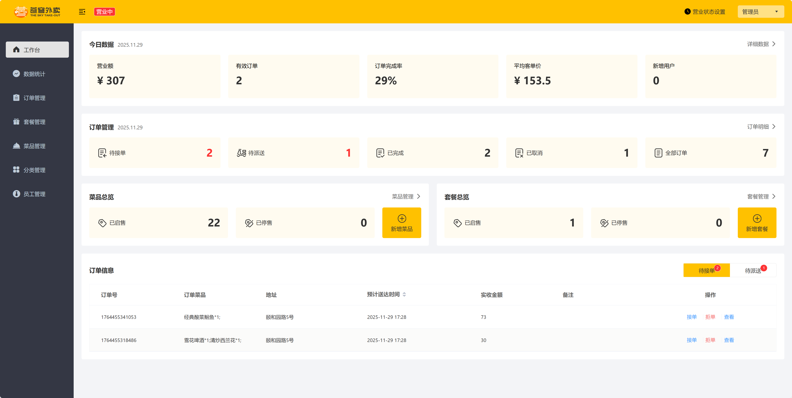
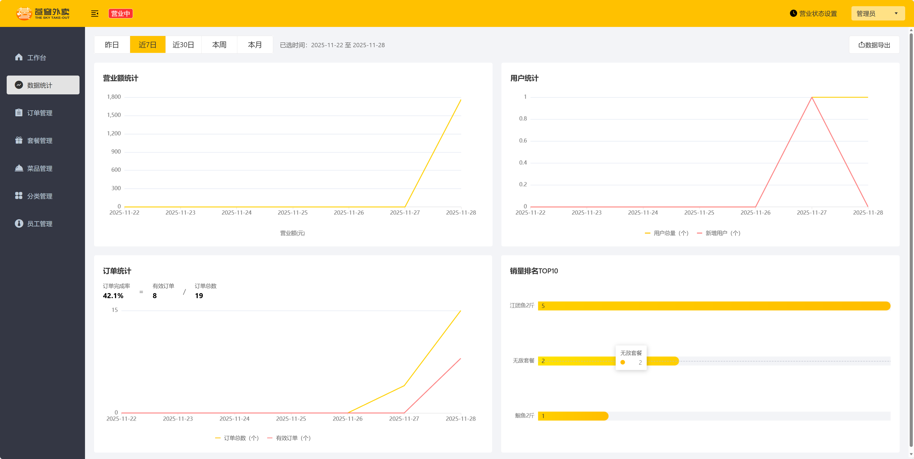
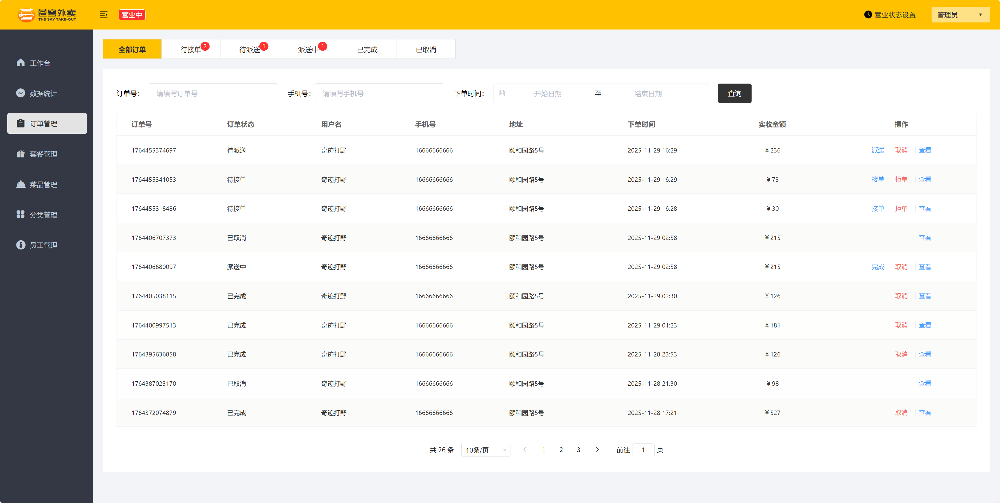
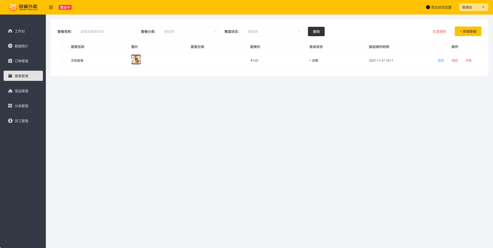
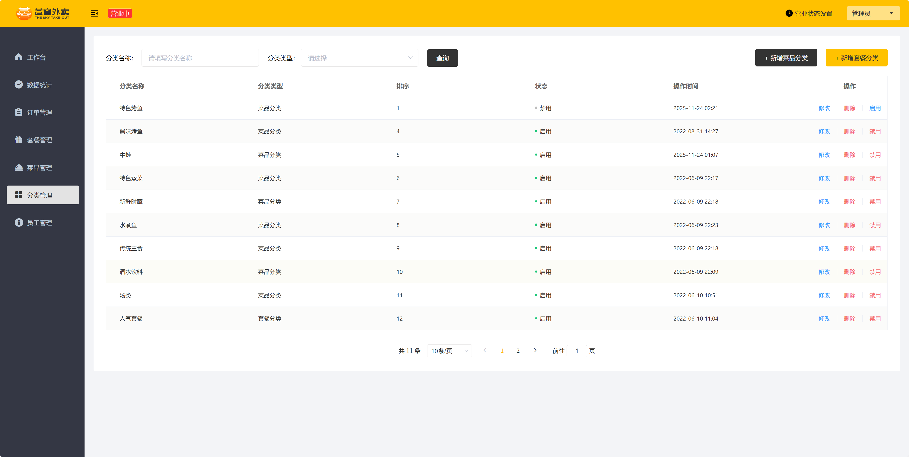
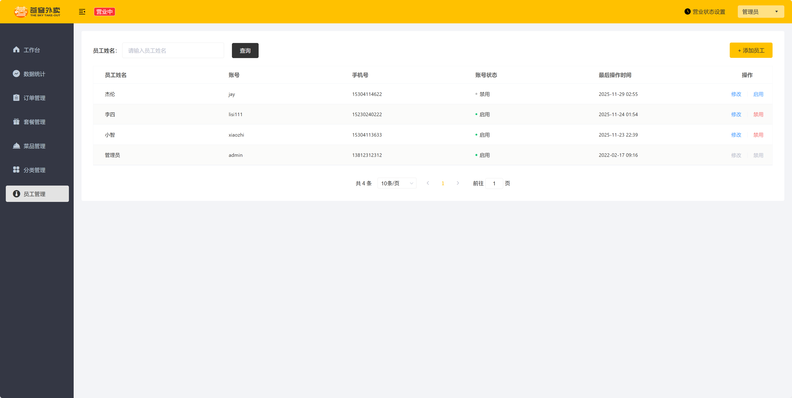
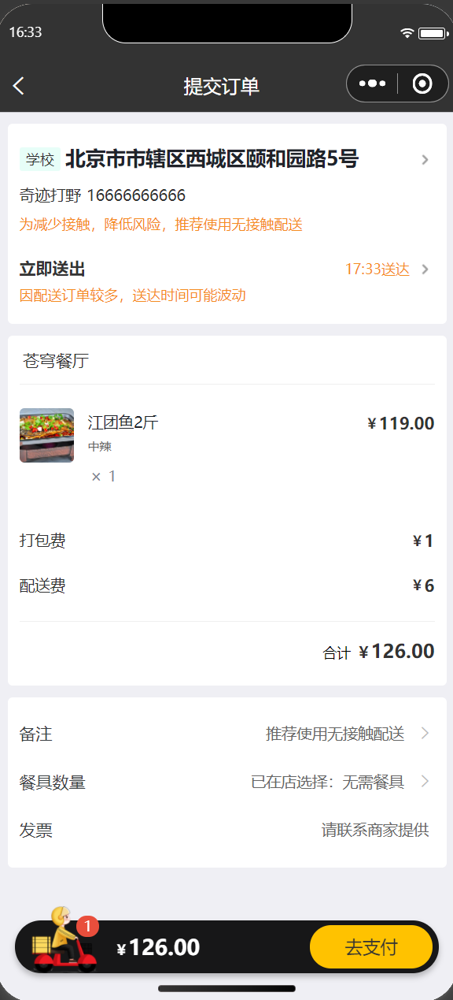
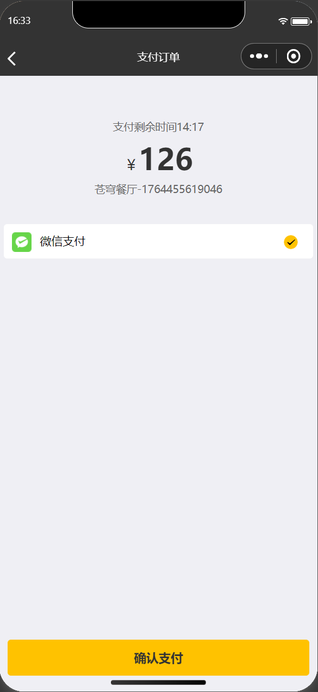
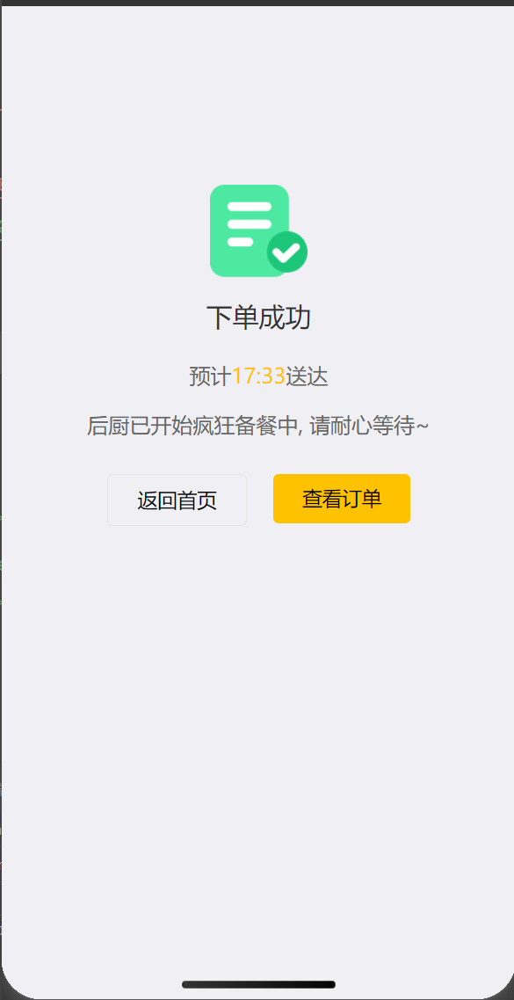
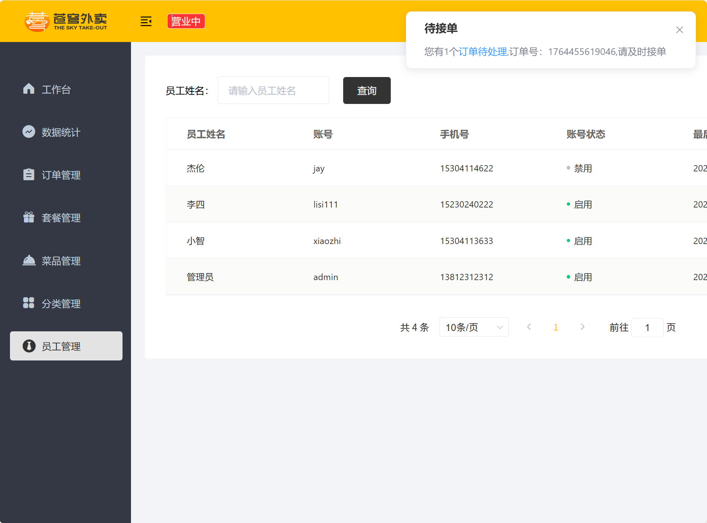

# 苍穹外卖实现

本地存储菜品图片，模拟微信支付（需修改前端支付逻辑，始终支付成功），使用百度地图API。

## Windows 环境运行指南

### 1. 环境准备
在运行本项目之前，请确保您的电脑已安装并配置好以下环境：
- **JDK 1.8+**
- **Maven**
- **MySQL 5.7+**
- **Redis**
- **微信开发者工具**

### 2. 克隆仓库
使用 [仓库地址](https://github.com/ZzzeLoong/sky-take-out.git) 将代码克隆到本地：

```bash
git clone [https://github.com/ZzzeLoong/sky-take-out.git](https://github.com/ZzzeLoong/sky-take-out.git)
```

### 3. 导入数据库
使用 sql/sky.sql 文件将表结构和初始数据导入数据库。


### 4. 后端配置
**修改配置文件：** 找到 sky-server/src/main/resources/application-dev-sample.yml 文件

    请将该文件重命名为 application-dev.yml（去掉 -sample 后缀），或者复制一份并重命名，否则系统可能无法读取配置。

需要修改的关键配置项包括：
- MySQL： 账号与密码
- Redis： 端口与密码（如有）
- 微信小程序： appid 和 secret
- 其他三方服务： 百度地图 API、阿里云 OSS 等配置（如需使用相关功能）

### 5. 小程序配置
1. 打开 wechat_user-client/miniprogram-2/project.config.json 文件。
2. 修改其中的 appid 字段为自己的小程序 AppID。
3. 打开微信开发者工具，导入 wechat_user-client 文件夹中的项目文件。
4. 在开发者工具右上角【详情】->【本地设置】中，勾选“不校验合法域名、web-view（业务域名）、TLS版本以及 HTTPS 证书”。 

### 6. 启动服务
   请按照以下顺序启动服务：

1. 启动基础服务： 确保 MySQL 和 Redis 服务均已启动并运行正常。

2. 启动 Nginx (管理端前端)：
- 进入 admin-client/nginx-1.20.2/ 目录。
- 双击 nginx.exe 启动。
- 注：如需修改端口，请编辑 conf/nginx.conf 文件。Nginx文件夹路径需要是全英文路径。

3. 启动后端服务：
- 运行 sky-server/src/main/java/com/sky/SkyApplication.java 中的 main 方法启动后端服务器。

### 7. 访问系统
- 管理端后台： 打开浏览器访问：http://localhost:80 (端口号取决于 Nginx 配置，默认为 80)。

- 小程序用户端： 在微信开发者工具中点击“编译”即可预览和调试。













